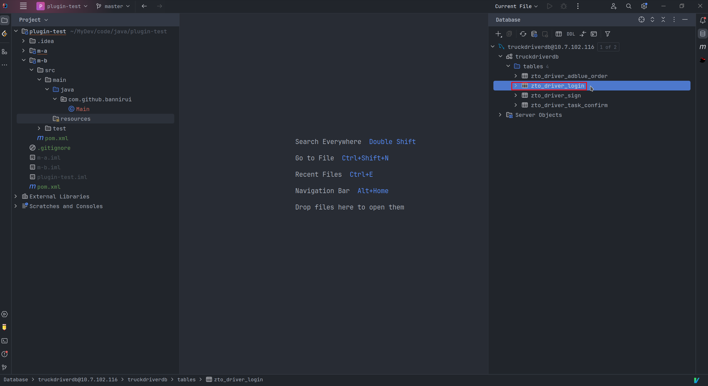
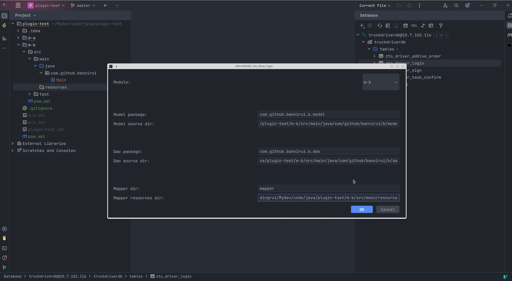
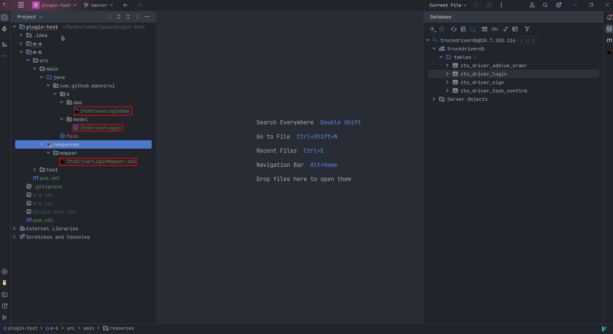

## ORM-GENERATOR

Java DevKit, help to generate ORM(mybatis) code.
  
 

[🌐 简体中文](README.zh-CN.md)

[ToDo list](./TODO.md)

### Quick Start

#### 1 Dependency

A must support with IDEA on Database tool.

#### 2 Action

Select one table, then right click, select the button called `ORM Generator` since actions list displaying.

#### 3 Specify file path

Specify the parameter according to the dialog.

#### 4 Generate

Plugin would generate the file you want.

